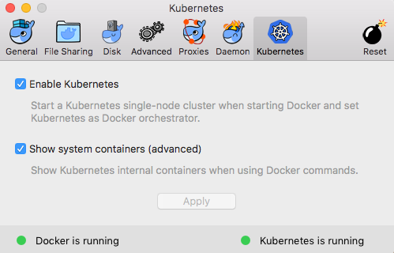
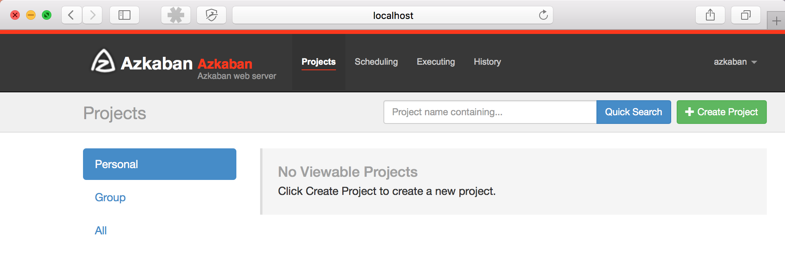

# azkaban-kubernetes-osx
Run Azkaban Scheduler on Kubernetes for OSX

More about Azkaban Scheduler: https://azkaban.github.io/ (frequently used together with Hadoop)

# 1. Prerequisites: 
1. Install Docker for Mac (new version that has Kubernetes) - https://www.docker.com/docker-mac
2. Enable Kubernetes in Docker UI



3. Set kubernetes context (in Terminal)
```
kubectl config use-context docker-for-desktop  
```

# 2. Install Azkaban scheduler (from Terminal)
```
$ docker stack deploy azkaban -c azkaban/docker-compose.yml
```

## 2.1. Should expect something like this (might take a few minutes < 5)
```
Stack azkaban was created
Waiting for the stack to be stable and running...
 - Service azkweb has one container running
 - Service mysql has one container running
 - Service azkexec has one container running
Stack azkaban is stable and running
```

# 3. Open browser on http://localhost:8081
Use username and password: azkaban

## 3.1 Should get something like this in the browser



# 4. See Kubernetes status related to Azkaban (your output might be different)

```
$ kubectl get stacks
NAME      AGE
azkaban   1m
```

```
$ kubectl get services
NAME         TYPE           CLUSTER-IP       EXTERNAL-IP   PORT(S)           AGE
azkexec      LoadBalancer   10.104.255.224   <pending>     12321:31580/TCP   1m
azkweb       LoadBalancer   10.103.164.110   <pending>     8081:32019/TCP    1m
kubernetes   ClusterIP      10.96.0.1        <none>        443/TCP           1d
mysql        LoadBalancer   10.97.203.183    <pending>     3306:30034/TCP    1m
```

```
$ kubectl get pods
NAME                       READY     STATUS    RESTARTS   AGE
azkexec-54b45859c4-k8cwd   1/1       Running   0          1m
azkweb-6fdb78f977-l467h    1/1       Running   0          1m
mysql-67445f897f-w4zb8     1/1       Running   0          1m
```

# Appendix - Learn more about Kubernetes (for OSX on Mac)

1. https://blog.alexellis.io/docker-for-mac-with-kubernetes/


